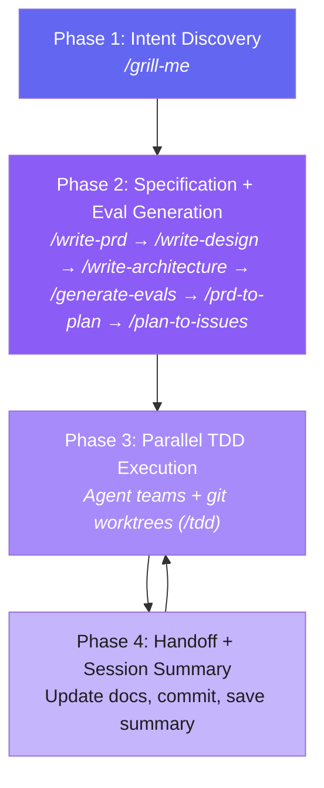

# Agentic Workflow Prompt Framework

## Purpose

This framework bootstraps and manages software projects through an AI-driven agentic workflow. It solves the cold-start problem — where each new agent conversation loses track of what was done, what's next, and why the project exists — by front-loading specification, generating living project documents, and maintaining a self-updating roadmap synced with GitHub Issues.

## Workflow Overview

Four sequential phases. Phases 3 and 4 loop **per subtask** until the project is complete — each subtask goes through Phase 3 (TDD implementation) then Phase 4 (documentation update and session handoff). Wave transitions (merge, regression, issue sync) run at wave boundaries, not after every subtask. Each phase orchestrates **skills** — focused, reusable prompt units invocable standalone or as part of a phase.



> **Wave transitions** (merge to main, regression gate, issue sync) are a separate protocol that runs at wave boundaries. See `wave-execution.md` Section 2.

### The Complete Dev Flow

```
/grill-me → /write-prd → /write-design → /write-architecture → /generate-evals → /prd-to-plan → /plan-to-issues → /tdd
```

Each skill can also be invoked independently at any time. Skill definitions live in `skills/<skill-name>/SKILL.md`.

---

## Skill Index

| Skill | Phase | Input | Output | Required |
|-------|-------|-------|--------|----------|
| `/grill-me` | 1 | Project idea | Confirmed intent (Echo Check) | Yes |
| `/write-prd` | 2 | Echo Check | `docs/prd.md` | Yes |
| `/write-design` | 2 | Echo Check + `docs/prd.md` | `docs/design.md` (Stitch prototypes) | Yes |
| `/write-architecture` | 2 | Echo Check + `docs/prd.md` + `docs/design.md` | `docs/architecture.md` | Yes |
| `/generate-evals` | 2 | `docs/prd.md` + `docs/architecture.md` | `docs/evals.json` | Yes |
| `/prd-to-plan` | 2 | `docs/prd.md` + `docs/architecture.md` | Implementation plan | Yes |
| `/plan-to-issues` | 2 | Plan | GitHub Issues + `roadmap.json` | Yes |
| `/tdd` | 3 | Subtask from `roadmap.json` | Implemented + tested code | Yes |

### Skill Dependency Matrix

| Skill | Required Inputs (halt if missing) | Optional Inputs (use if available) | Outputs |
|-------|-----------------------------------|------------------------------------|---------|
| `/grill-me` | Project idea (from user) | Existing codebase | `docs/echo-check.md` |
| `/write-prd` | Project idea or `docs/echo-check.md` (at least one) | Existing codebase | `docs/prd.md` |
| `/write-design` | `docs/echo-check.md`, `docs/prd.md` | Existing codebase, design assets | `docs/design.md` |
| `/write-architecture` | `docs/echo-check.md`, `docs/prd.md`, `docs/design.md` | Existing codebase | `docs/architecture.md` |
| `/generate-evals` | `docs/prd.md`, `docs/architecture.md` | `docs/design.md`, existing codebase | `docs/evals.json` |
| `/prd-to-plan` | `docs/prd.md`, `docs/architecture.md` | `docs/evals.json`, existing codebase | `plans/<feature>.md` |
| `/plan-to-issues` | `plans/<feature>.md`, `roadmap.json` | `gh` CLI | GitHub Issues, updated `roadmap.json` |
| `/tdd` | `roadmap.json`, `docs/evals.json`, relevant source files | — | Implemented + tested code, updated `docs/evals.json` |

---

## Key Rules

These are cross-cutting principles that no single file owns. For domain-specific rules, see the relevant skill or phase file.

- **Vertical slices, not horizontal layers** — every task cuts through all integration layers end-to-end. The first slice is the *tracer bullet* that proves the full stack works. One test, one implementation, repeat. Never batch.
- **TDD: tests before code** — RED (failing test) → GREEN (minimal pass) → REFACTOR. Each stage gets its own commit. See `skills/tdd/SKILL.md`.
- **Evals before code** — `docs/evals.json` is generated before any implementation begins.
- **Test protection** — never remove, delete, or weaken existing tests or evals. Fix the code, not the test.
- **Roadmap is source of truth** — all progress flows through `roadmap.json`. GitHub Issues are the visibility layer, synced to match. See `github-issue-sync.md`.
- **Session summaries are mandatory** — every phase/subtask ends with a saved summary. This is the sole bridge between cleared conversations.
- **Deep modules over shallow wrappers** — small interfaces, deep implementations. See `skills/tdd/deep-modules.md`.
- **Orchestrator is sole `roadmap.json` writer (agent team mode only)** — when using agent teams (`agent-teams.md`), implementers report via SendMessage; only the orchestrator writes roadmap updates. In solo mode, the executing agent writes `roadmap.json` directly. In bash-script parallel mode, individual worktree agents do NOT update `roadmap.json` during execution — the main-branch script updates it centrally after all agents in a wave complete and branches are merged.
- **Project completion is explicit** — a project is not done until the completion gate passes. See `workflow-automation.md` Section 7.
- **Budget awareness** — each task has a `max_turns` budget in `roadmap.json`. Orchestrators escalate when exceeded.

---

## Source of Truth

| Information | Authoritative Source |
|-------------|---------------------|
| Phase prompts and gate definitions | Individual files in `phases/` |
| Skill definitions and processes | `skills/<skill-name>/SKILL.md` |
| TDD reference library | Companion docs in `skills/tdd/` |
| Design skill reference | `skills/write-design/SKILL.md` |
| Architecture skill reference | `skills/write-architecture/SKILL.md` |
| Template structure | Individual files in `templates/` |
| Session chaining + alternative automation | `workflow-automation.md` |
| Agent team execution (primary protocol) | `agent-teams.md` |
| GitHub issue sync protocol | `github-issue-sync.md` |
| Project completion criteria | `workflow-automation.md` Section 7 |
| Wave execution rules | `wave-execution.md` |
| Error handling and escalation | `error-protocol.md` |
| Framework overview (this file) | `CLAUDE.md` |

---

## Glossary

| Term | Definition | Defined In |
|------|-----------|------------|
| **Echo Check** | Structured summary of all decisions from Phase 1 discovery. Bridge between Phase 1 and Phase 2. | `skills/grill-me/SKILL.md` |
| **Eval** | A specific test scenario with inputs, expected outputs, and pass/fail status. Stored in `docs/evals.json`. | `templates/evals.schema.json` |
| **Track** | A logical grouping of related tasks in `roadmap.json` (e.g., "Frontend", "Backend"). Formerly called "phase" in the roadmap. | `templates/roadmap.schema.json` |
| **Vertical slice** | An architectural principle: every task cuts through all integration layers end-to-end. | `CLAUDE.md` Key Rules |
| **Tracer bullet** | The first vertical slice in an implementation plan. Proves the full stack works before building breadth. | `skills/tdd/SKILL.md` |
| **Wave** | A group of tasks that can execute in parallel with no mutual dependencies or file overlap. | `wave-execution.md` |
| **Deep module** | A module with a simple interface hiding significant internal complexity (Ousterhout). | `skills/tdd/deep-modules.md` |
| **Gate** | A checklist of conditions that must pass before entering or exiting a phase. | Phase files in `phases/` |
| **Session summary** | A structured record of what happened in one agent session. The sole bridge between cleared conversations. | `templates/session-summary.md` |
| **HITL / AFK** | Human-in-the-loop (requires user interaction) vs fully autonomous task classification. | `templates/roadmap.schema.json` |

---

## File Structure

```
Claude-Architecture/
├── phases/                          # Workflow phases (orchestration wrappers)
│   ├── phase-1-intent-discovery.md
│   ├── phase-2-specification-eval-generation.md
│   ├── phase-3-subtask-execution.md
│   └── phase-4-handoff-protocol.md
├── skills/                          # Reusable skill definitions (execution logic)
│   ├── grill-me/SKILL.md
│   ├── write-prd/SKILL.md
│   ├── prd-to-plan/SKILL.md
│   ├── plan-to-issues/SKILL.md
│   ├── write-design/
│   │   └── SKILL.md                 # Design document + Stitch prototyping
│   ├── write-architecture/
│   │   └── SKILL.md                 # Architecture document generation
│   ├── generate-evals/
│   │   └── SKILL.md                 # Eval suite generation from PRD + architecture
│   ├── tdd/
│   │   ├── SKILL.md                 # TDD red-green-refactor skill
│   │   ├── tests.md                 # Good vs bad tests
│   │   ├── deep-modules.md          # Deep module design (Ousterhout)
│   │   ├── interface-design.md      # Testable interface principles
│   │   ├── mocking.md              # When and how to mock
│   │   └── refactoring.md          # Refactoring candidates after GREEN
├── templates/                       # Document templates (copy into target projects)
│   ├── claude.md                    # Project intelligence file
│   ├── prd.md                       # Product requirements
│   ├── design.md                    # Design document
│   ├── architecture.md              # Technical architecture
│   ├── echo-check.md               # Echo Check output template
│   ├── evals.json                   # Evaluation suite
│   ├── evals.schema.json           # Evaluation suite JSON Schema
│   ├── roadmap.json                 # Living task list
│   ├── roadmap.schema.json         # Roadmap JSON Schema
│   └── session-summary.md           # Session summary
├── plans/                           # Implementation plans
├── agent-teams.md                   # Agent team execution protocol (primary)
├── error-protocol.md                # Shared error handling protocol
├── wave-execution.md                # Wave execution rules
├── github-issue-sync.md             # GitHub Issue sync protocol
├── workflow-automation.md           # Session chaining + automation options
└── CLAUDE.md                        # THIS FILE
```

---

## Getting Started

### New Project

1. **Phase 1:** Invoke `/grill-me` with your project idea. Answer questions until the Echo Check confirms shared understanding.
2. **Phase 2:** Chain `/write-prd` → `/write-design` → `/write-architecture` → `/generate-evals` → `/prd-to-plan` → `/plan-to-issues`. This produces all project documents, GitHub issues, and the execution plan.
3. **Phase 3:** Execute subtasks via `/tdd`. The recommended model is **agent teams with git worktrees** — see `agent-teams.md`. For simpler alternatives, see `workflow-automation.md`.

Phase 4 runs automatically after each subtask.

### Resuming Mid-Flight

1. Read the project's `claude.md` for current status
2. Read the latest file in `session-summary/` for last session context
3. Read `roadmap.json` to find the next uncompleted task
4. Run the Entry Gate from the relevant phase file

### Automation Options

Multiple execution models for Phase 3, from full parallel orchestration to simple manual loops. See `agent-teams.md` for the primary protocol. See `workflow-automation.md` for alternative models.

| Model | Mechanism | Human Involvement |
|-------|-----------|-------------------|
| Agent Team (Recommended) | AI orchestrator + specialist agents + reviewer gate, pre-flight validation, rollback, recovery | Orchestrator stays open |
| Parallel Waves | Git worktrees per wave via bash scripts | None |
| CLI Headless Loop | `claude -p "continue"` in a loop | None |
| SessionStart Hook | Hook injects context after `/clear` | Minimal |
| Ralph Loop | Invoke skills manually in sequence | Full control |

---

## Current Status

This repository contains the framework itself — no active project is being built. Use this as a starting kit for new projects.

**Fastest path:** Invoke `/grill-me` with your project idea, then chain through `/write-prd` → `/write-design` → `/write-architecture` → `/generate-evals` → `/prd-to-plan` → `/plan-to-issues` → `/tdd` manually.
