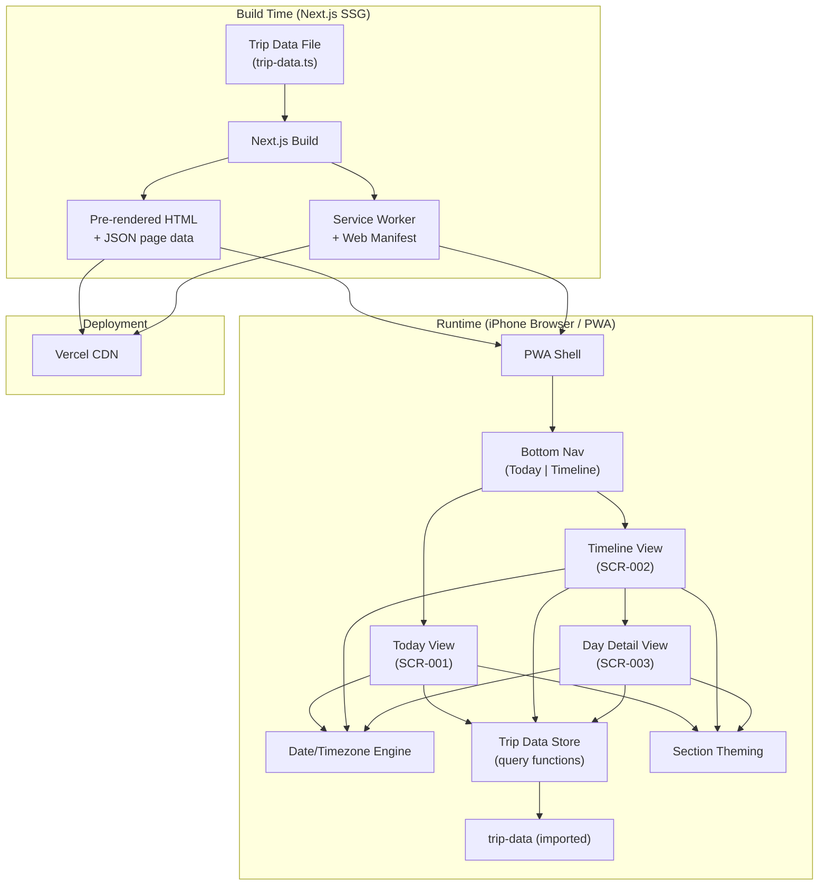
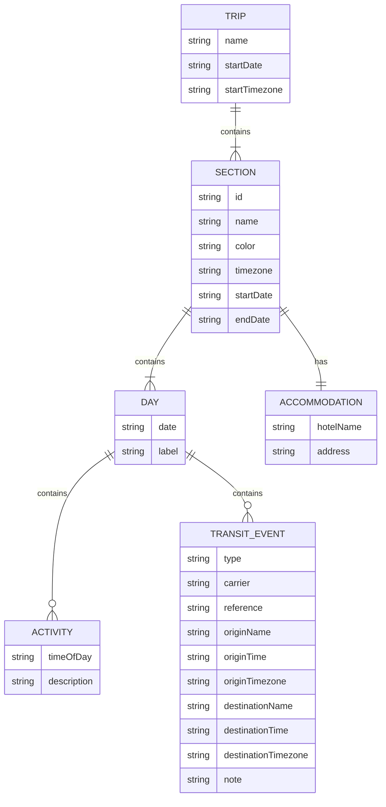
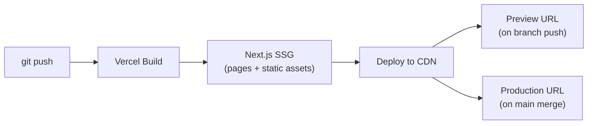

# Architecture: TripCompanion

## 1. System Overview



**Architecture style:** Static site with client-side date awareness. All trip data is baked into the build at deploy time. The only runtime logic is determining "today" and formatting times — there is no server, no API, no database.

## 2. Component Design

### 2.1 Trip Data Store

- **Responsibility:** Single TypeScript file defining all trip sections, days, activities, transit events, and accommodation. Exposes pure query functions that components call to get the data they need. Owns the data shape and all data access logic.
- **Implements:** US-004, US-007, US-008, US-009, US-010, US-013, US-014
- **Public Interface:**
  ```typescript
  getAllSections(): Section[]
  getSection(date: Date): Section | null
  getDayData(date: Date): DayData | null
  getNextTransit(from: Date): TransitEvent | null
  getAccommodation(date: Date): Accommodation | null
  ```
- **Internal Complexity Hidden:** Section boundary logic (travel days belong to departing section), chronological transit sorting across sections, placeholder data handling.
- **Error Handling:** Returns `null` for dates outside trip range. No exceptions — callers check for null.
- **Key Dependencies:** None (leaf module). Consumed by Today View, Timeline View, Day Detail View.

### 2.2 Date/Timezone Engine

- **Responsibility:** Cumulative day counting from Day 1 (Sydney departure), "is today" detection, and local time formatting per section timezone. All functions are pure — no side effects, no global state.
- **Implements:** US-003, US-008, US-011
- **Public Interface:**
  ```typescript
  getCumulativeDay(date: Date, tripStartDate: Date): number
  isToday(dayDate: string, timezone: string): boolean
  formatLocalTime(isoTime: string, timezone: string): string
  getTripStatus(today: Date, tripStart: Date, tripEnd: Date): 'before' | 'during' | 'after'
  ```
- **Internal Complexity Hidden:** IANA timezone resolution, DST edge cases, midnight boundary handling across timezone transitions (AEST → CET → EEST → TRT).
- **Error Handling:** Invalid timezone strings fall back to UTC with console warning.
- **Key Dependencies:** `Intl.DateTimeFormat` (built-in). No third-party date libraries.

### 2.3 Section Theming

- **Responsibility:** Maps section IDs to color tokens and injects them as CSS custom properties. Provides the visual wayfinding layer — components consume `var(--section-accent)` without knowing which section is active.
- **Implements:** US-005, US-012, SCR-001, SCR-002, SCR-003
- **Public Interface:**
  ```typescript
  // CSS custom properties set on a wrapper element:
  --section-accent: <hex>
  --section-accent-10: <hex at 10% opacity>

  // React component:
  <SectionThemeProvider sectionId={string}>
    {children}
  </SectionThemeProvider>
  ```
- **Internal Complexity Hidden:** Color token lookup, opacity variant generation, fallback to default color for unknown section IDs.
- **Error Handling:** Unknown section ID → falls back to neutral gray accent.
- **Key Dependencies:** Section color map (defined in theme config). Consumed by all view components.

### 2.4 Today View (SCR-001)

- **Responsibility:** Default landing screen. Composes day number, section header, activity list, next transit card, and accommodation into a single glance-first view. Determines "today" on mount and renders accordingly.
- **Implements:** US-001, US-002, US-003, US-010, US-011, US-012, SCR-001
- **Public Interface:** React page component, no props (reads from Trip Data Store + Date/Timezone Engine).
- **Internal Complexity Hidden:** Trip status detection (before/during/after), "no transit today" fallback to next future transit, section resolution for current date.
- **Error Handling:** Before-trip and after-trip states render informational messages instead of empty views.
- **Key Dependencies:** Trip Data Store, Date/Timezone Engine, Section Theming, Transit Card, Activity List Card, Accommodation Card.

### 2.5 Timeline View (SCR-002)

- **Responsibility:** Scrollable full-trip overview grouped by section → day. Shows compact day rows with summary text. Highlights the current day and auto-scrolls it into view.
- **Implements:** US-004, US-005, US-006, US-011, US-012, SCR-002
- **Public Interface:** React page component, no props.
- **Internal Complexity Hidden:** Auto-scroll to current day on mount, section grouping logic, day row summary text generation.
- **Error Handling:** Before/after trip — all days shown, none highlighted.
- **Key Dependencies:** Trip Data Store, Date/Timezone Engine, Section Theming.

### 2.6 Day Detail View (SCR-003)

- **Responsibility:** Expanded view of a single day showing all transit cards, activities, and accommodation. Reached by tapping a day row in Timeline View.
- **Implements:** US-006, US-007, US-008, US-009, US-010, US-011, SCR-003
- **Public Interface:** React page component. Receives day identifier via route parameter or navigation state.
- **Internal Complexity Hidden:** Multiple transit card ordering, back navigation state preservation.
- **Error Handling:** Invalid day parameter → redirect to Timeline View.
- **Key Dependencies:** Trip Data Store, Date/Timezone Engine, Section Theming, Transit Card, Activity List Card, Accommodation Card.

### 2.7 Transit Card

- **Responsibility:** Presentational component rendering a single transit event (flight, train, or ferry) with all booking details.
- **Implements:** US-007, US-008, US-009
- **Public Interface:**
  ```typescript
  <TransitCard
    type: 'flight' | 'train' | 'ferry'
    carrier: string
    reference: string
    origin: { name: string, time: string, timezone: string }
    destination: { name: string, time: string, timezone: string }
    note?: string
  />
  ```
- **Internal Complexity Hidden:** Transit type icon selection, time formatting delegation to Date/Timezone Engine, note rendering when present.
- **Error Handling:** Missing optional fields (note) gracefully hidden.
- **Key Dependencies:** Date/Timezone Engine (for time formatting), Section Theming (for accent border color).

### 2.8 PWA Shell

- **Responsibility:** Service worker registration, web manifest configuration, offline caching strategy, and manual refresh capability. Makes the app installable to iPhone home screen and functional without network.
- **Implements:** US-015, US-016, US-017
- **Public Interface:** No component API — configured via `next.config.js` and manifest file.
- **Internal Complexity Hidden:** Cache-first service worker strategy, cache versioning, manual refresh triggering cache invalidation, iOS-specific PWA meta tags.
- **Error Handling:** Service worker registration failure → app still works (just without offline support). Manual refresh with no network → shows "offline" toast.
- **Key Dependencies:** `next-pwa` or equivalent Next.js PWA plugin.

### Coverage Check

| ID | Component(s) |
|----|--------------|
| US-001 | Today View |
| US-002 | Today View |
| US-003 | Today View, Date/Timezone Engine |
| US-004 | Timeline View, Trip Data Store |
| US-005 | Timeline View, Section Theming |
| US-006 | Timeline View, Day Detail View |
| US-007 | Transit Card, Trip Data Store, Day Detail View |
| US-008 | Transit Card, Date/Timezone Engine, Day Detail View |
| US-009 | Transit Card, Day Detail View |
| US-010 | Today View, Day Detail View, Trip Data Store |
| US-011 | Today View, Timeline View, Day Detail View, Date/Timezone Engine |
| US-012 | Today View, Timeline View, Section Theming |
| US-013 | Trip Data Store |
| US-014 | Trip Data Store |
| US-015 | PWA Shell |
| US-016 | PWA Shell |
| US-017 | PWA Shell |
| SCR-001 | Today View, Section Theming |
| SCR-002 | Timeline View, Section Theming |
| SCR-003 | Day Detail View, Section Theming |

All user stories and screens covered.

## 3. Data Model

### 3.1 ER Diagram



### 3.2 Entity Descriptions

| Entity | Key Fields | Description |
|--------|-----------|-------------|
| Trip | name, startDate, startTimezone | Top-level container. `startDate` anchors the cumulative day counter. |
| Section | id, name, color, timezone, startDate, endDate | A destination leg of the trip (e.g., "Switzerland"). Owns timezone and accent color. Travel days belong to the departing section. |
| Day | date, label | A single calendar day within a section. `label` is a short summary (e.g., "Arrive Zürich"). |
| Activity | timeOfDay, description | One activity within a day. `timeOfDay` is "morning", "afternoon", or "evening". |
| TransitEvent | type, carrier, reference, origin/destination (name + time + tz), note | A flight, train, or ferry leg with full booking details. Times stored with explicit IANA timezone. |
| Accommodation | hotelName, address | Where the traveler stays during a section. One per section. |

### 3.3 Data Access Patterns

All data is read-only at runtime. The single `trip-data.ts` file is imported directly — no async loading, no API calls, no database queries.

| Pattern | Description |
|---------|-------------|
| **Get today's data** | `getSection(today)` → current section; `getDayData(today)` → activities + transit for today |
| **Get next transit** | `getNextTransit(now)` → scan all transit events chronologically, return the first one after `now` |
| **Get full timeline** | `getAllSections()` → all sections with nested days, iterated for rendering |
| **Get day detail** | `getDayData(date)` → all activities and transit events for a specific date; `getAccommodation(date)` → hotel for that date's section |

No caching strategy needed — data is static and in-memory after page load.

## 4. API Design

**Not applicable.** TripCompanion has no API layer. All data is statically imported from `trip-data.ts` at build time and pre-rendered into HTML pages. There are no API routes, no server endpoints, and no network requests at runtime.

The public interface is the Trip Data Store's query functions (Section 2.1) consumed by React components via direct import.

## 5. Infrastructure & Deployment

### Environments

| Environment | Purpose | URL |
|-------------|---------|-----|
| Local dev | Development + hot reload | `localhost:3000` |
| Preview | Auto-deployed per git push (Vercel) | `*.vercel.app` (auto-generated) |
| Production | Live app | Obscure Vercel URL (no custom domain needed) |

### CI/CD Pipeline



- **Build:** `next build` — static export, all pages pre-rendered
- **Tests:** Run via `npm test` before build (Vitest)
- **Deploy:** Vercel auto-deploys on push — zero config
- **Rollback:** Vercel instant rollback to previous deployment

### Hosting & Scaling

- **Vercel** — static hosting with global CDN edge network
- **No server compute** — all pages are static HTML + JS bundles
- **No scaling concerns** — single user, static assets served from CDN cache
- **HTTPS** — automatic via Vercel

### Monitoring

Not applicable for a personal static app. Vercel provides basic deployment logs and build status.

## 6. Design Decisions Log

| Decision | Alternatives Considered | Rationale |
|----------|------------------------|-----------|
| Single TypeScript data file over JSON | JSON file, MDX files per day, CMS | TS file gives type safety, IDE autocompletion, and can export both data and query functions from one module. JSON would need a separate query layer. |
| `Intl.DateTimeFormat` over date-fns/luxon | date-fns, luxon, dayjs | Built-in API handles IANA timezones natively. No dependency needed for the 4 formatting operations this app requires. Reduces bundle size. |
| Query functions co-located with data file | Separate data-access service, React context + hooks | Co-location means one import gives you everything. Separate service adds indirection for no benefit in a static app. React context is unnecessary when data is synchronous and immutable. |
| CSS custom properties for theming over Tailwind variants | Tailwind `data-*` variants, styled-components ThemeProvider, CSS modules per section | CSS custom properties work with any styling approach, are native, and let a single `SectionThemeProvider` wrapper swap all colors. Tailwind variants would scatter section logic across every component. |
| Next.js App Router with static export | Pages Router, Vite + React Router, plain React SPA | App Router is the current Next.js standard. Static export (`output: 'export'`) gives SSG without a server. Vite would work but loses Vercel's zero-config integration. |
| `next-pwa` plugin for service worker | Workbox directly, custom service worker, Serwist | `next-pwa` (or its maintained fork Serwist) integrates with Next.js build pipeline. Custom service worker is more work for the same cache-first result. |
| No client-side routing for Day Detail | Dynamic route (`/day/[date]`), modal overlay | URL-based route (`/day/2026-07-14`) enables browser back button and works naturally with Next.js static export. Modal would need custom back-button handling. |
| Vitest over Jest | Jest, Testing Library only | Vitest is faster, has native ESM support, and integrates well with Vite-based builds. Next.js works with both; Vitest requires less configuration. |
| No third-party component library | shadcn/ui, Radix, MUI | The app has ~6 simple components (cards, badges, nav). A component library adds bundle size and styling complexity for components that are trivial to build. |

## 7. Security Considerations

### 7.1 Authentication
Not applicable. This is a personal single-user app with no accounts, no login, and no user data. Access is controlled by URL obscurity only.

### 7.2 Authorization
Not applicable. No roles, no permissions. All data is read-only and public to anyone with the URL.

### 7.3 Data Protection
- No PII beyond travel dates and hotel names (which are placeholder data initially)
- All traffic encrypted in transit via Vercel's automatic HTTPS
- No data stored on any server — everything is in the static build
- No cookies, no local storage, no analytics

### 7.4 Secrets Management
No secrets. No API keys, no database credentials, no environment variables with sensitive data. The only build-time configuration is standard Next.js settings.

## 8. Future Considerations

### Known Technical Debt
| Item | Why It's Acceptable Now |
|------|------------------------|
| Hardcoded trip data in source code | Single-use app for one trip. A data editor or CMS would be overengineering. |
| No automated E2E tests | 6 components, 3 screens, no backend. Unit + integration tests on data/timezone logic cover the risk areas. E2E can be added if the app grows. |
| No dark mode | Deliberate design choice (light cream base). Not debt — it's a scoped decision. |

### If the App Were to Grow
- **Multiple trips:** Refactor `trip-data.ts` into a directory of trip files; add a trip selector view.
- **Shared access:** Add authentication (Vercel Auth or NextAuth) and move trip data to a database.
- **Live data:** Add API routes for flight status, weather. Would require moving from static export to server-side rendering.
- **Collaborative editing:** Would need a backend (database + API) and real-time sync. Fundamentally different architecture.

None of these are planned. The app is designed for a single trip, single user, single deployment.
