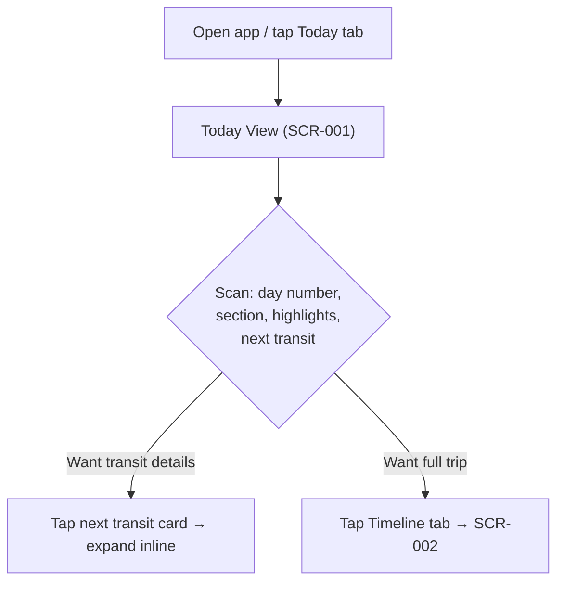
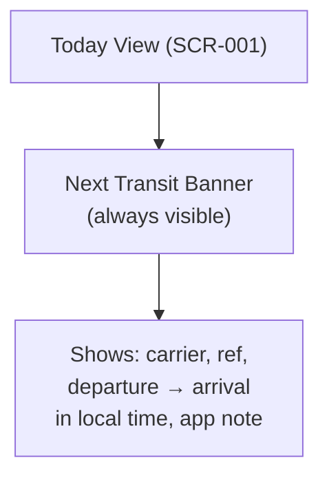
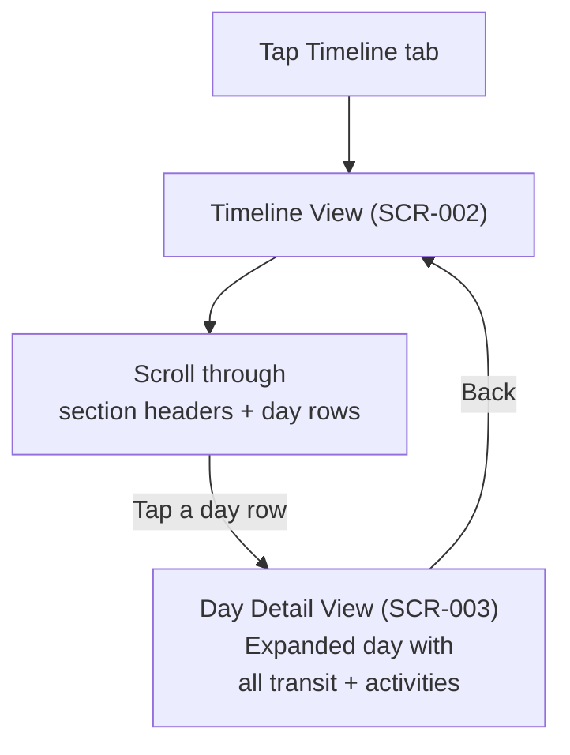

# Design: TripCompanion

## 1. Design Principles

| Principle | Description | Traced to |
|-----------|-------------|-----------|
| **Glance-first** | Information hierarchy prioritizes scanability. Large day numbers, bold section names, key times prominent. No walls of text. | US-001, US-002 |
| **Mobile-first** | Designed for iPhone viewport (375–430px). Single column layout. Touch-friendly tap targets (44px minimum). | All user stories |
| **Calm and warm** | Light cream base (#FFFBF5) with subtle shadows. Not clinical white. Travel should feel exciting but organized. | US-012 |
| **Card-based** | Transit events, daily highlights, and accommodation are presented as discrete cards with rounded corners and subtle elevation. | US-006, US-007, US-010 |
| **Section-colored wayfinding** | Each destination section has its own accent color. Instantly know which part of the trip you're viewing. | US-005, US-012 |
| **Offline-ready** | Every view works from cached static data. No loading spinners, no empty states from network failure. | US-015 |

## 2. User Flows

### 2.1 "What's happening today?" (Primary Flow)



**User Stories:** US-001, US-002, US-003, US-011

### 2.2 "What's my next transit?" (Secondary Flow)



**User Stories:** US-002, US-007, US-008, US-009

### 2.3 "Overview browse" (Tertiary Flow)



**User Stories:** US-004, US-005, US-006

## 3. Visual Design System

### 3.1 Color Palette

| Role | Color | Hex | Usage |
|------|-------|-----|-------|
| **Background** | Cream | `#FFFBF5` | App background, page canvas |
| **Card surface** | White | `#FFFFFF` | All card backgrounds |
| **Text primary** | Near-black | `#1C1917` | Headings, body text |
| **Text secondary** | Warm gray | `#78716C` | Subtitles, notes, muted text |
| **Text on accent** | White | `#FFFFFF` | Text on section header banners |
| **Divider** | Light gray | `#E7E5E4` | Card separators, day row dividers |

**Section Accent Colors:**

| Section | Color | Hex | Contrast on white | Contrast on cream |
|---------|-------|-----|-------------------|-------------------|
| Switzerland | Red | `#DC2626` | 4.6:1 ✓ AA | 4.5:1 ✓ AA |
| Tomorrowland | Purple | `#7C3AED` | 4.8:1 ✓ AA | 4.7:1 ✓ AA |
| Rhodes | Blue | `#2563EB` | 4.6:1 ✓ AA | 4.5:1 ✓ AA |
| Turkey | Turquoise | `#0D9488` | 4.6:1 ✓ AA | 4.5:1 ✓ AA |

**Semantic Colors:**

| Role | Hex | Usage |
|------|-----|-------|
| Transit highlight | Section accent at 10% opacity | Next transit card background tint |
| Active indicator | Section accent | Current day left border, active tab |

### 3.2 Typography

| Role | Font | Weight | Size | Line Height |
|------|------|--------|------|-------------|
| Section heading | Plus Jakarta Sans | 700 (Bold) | 20px | 28px |
| Day number | Plus Jakarta Sans | 700 (Bold) | 24px | 32px |
| Card title | Plus Jakarta Sans | 600 (Semi) | 16px | 24px |
| Body text | Inter | 400 (Regular) | 14px | 20px |
| Caption/note | Inter | 400 (Regular) | 12px | 16px |
| Tab label | Inter | 500 (Medium) | 12px | 16px |

### 3.3 Spacing & Layout

| Token | Value | Usage |
|-------|-------|-------|
| Page padding | 16px | Left/right page margins |
| Card padding | 16px | Internal card padding |
| Card gap | 12px | Vertical space between cards |
| Section gap | 24px | Space between section groups |
| Card radius | 12px | Border radius on all cards |
| Card shadow | `0 1px 3px rgba(0,0,0,0.08)` | Subtle elevation |
| Accent border | 4px solid [section color] | Left border on transit cards, active day rows |

**Grid:** Single column, full-width cards with 16px horizontal margins. No multi-column layouts.

**Breakpoints:** Mobile-only (375–430px viewport). No tablet or desktop breakpoints — this is a personal iPhone app.

### 3.4 Component Library

#### Section Header Banner
- Full-width bar, section accent background color
- Destination name in white bold (20px Plus Jakarta Sans)
- Date range in white regular (14px Inter) below name
- Padding: 16px horizontal, 12px vertical

#### Day Badge
- Rounded pill shape, section accent background
- "Day N" in white bold (14px Plus Jakarta Sans)
- Minimum width 60px, height 28px

#### Transit Card
- White card, 12px radius, subtle shadow
- 4px left border in section accent color
- Layout:
  - **Row 1:** Transit type icon + "Flight/Train/Ferry to [Destination]" (16px semi-bold)
  - **Row 2:** "Carrier • Ref: XXXXXX" (14px, muted)
  - **Row 3:** "Origin HH:MM TZ → Destination HH:MM TZ" (14px)
  - **Row 4:** App note in italic muted text (12px)

#### Activity List Card
- White card, 12px radius
- Title "Today" or "Activities" (16px semi-bold)
- Bullet list of activities (14px Inter)
- Each bullet prefixed with time-of-day label (Morning/Afternoon/Evening)

#### Accommodation Card
- White card, 12px radius
- Small bed/hotel icon in section accent color
- Hotel name (16px semi-bold)
- Address in muted text (14px)

#### Bottom Navigation Bar
- Fixed to bottom, white background, top border (#E7E5E4)
- Two tabs: "Today" and "Timeline"
- Active tab: section accent color icon (filled) + label
- Inactive tab: muted gray icon (outline) + label
- Height: 56px, icons 24px

## 4. Screen Inventory

### 4.1 Today View {#SCR-001}
- **ID:** SCR-001
- **User Stories:** US-001, US-002, US-003, US-010, US-011, US-012
- **Purpose:** Default landing screen. Shows everything the traveler needs for the current day at a glance.
- **Key Elements:**
  - Section Header Banner (current section)
  - Day Badge + full date
  - Next Transit Banner (most prominent card)
  - Today's activity highlights (bullet list card)
  - Current accommodation card
  - Bottom navigation (Today tab active)
- **Layout:**
```
┌─────────────────────────┐
│ ██ SWITZERLAND ██████████│  ← Section header (red)
│ ██ Jul 12 – Jul 18 █████│
├─────────────────────────┤
│ [Day 3]  Monday, Jul 14 │  ← Day badge + date
├─────────────────────────┤
│ ┌─────────────────────┐ │
│ │▌Next: Train to       │ │  ← Next Transit card
│ │▌Interlaken           │ │     (red left border)
│ │▌SBB • Ref: ABC123   │ │
│ │▌Zürich 09:30 →      │ │
│ │▌Interlaken 11:45 CET│ │
│ │▌Use SBB Mobile app  │ │
│ └─────────────────────┘ │
│ ┌─────────────────────┐ │
│ │ Today                │ │  ← Activities card
│ │ • AM: Zürich Old Town│ │
│ │ • PM: Train          │ │
│ │ • PM: Check in hotel │ │
│ └─────────────────────┘ │
│ ┌─────────────────────┐ │
│ │ 🏨 Hotel Interlaken  │ │  ← Accommodation card
│ │ Höheweg 45, 3800    │ │
│ └─────────────────────┘ │
├─────────────────────────┤
│  ● Today    ○ Timeline  │  ← Bottom nav
└─────────────────────────┘
```
- **States:**
  - **Before trip:** Shows Day 1 section with "Trip starts [date]" message
  - **During trip:** Shows current day (default)
  - **After trip:** Shows final day with "Trip complete" message
  - **No transit today:** Next Transit Banner hidden; activities card fills space
- **Stitch Prototype:** [Today View](https://lh3.googleusercontent.com/aida/ADBb0ui7I_2SRiaa8G53st_Ni3LaMQEUIYiKipfCsv8BhYgSGlwTL8NELn5t7a3wviZb2QwludVau6pNGO7Enegmbl4dDV9c5WLuDjUJiykYms30aq76I5cKWuKFceVwS_6P075iA81v3Ru1pxVK8qVlsx0xXiKrm83nd9hB1CVC0VUIqbDaN_Qez4nI9Py6dpby6jdCtI9-P9jUOzdYkJvLIQrdz7l8D1v7BUFgYHA83SuKufzEAWW1lb1I9vY) (Stitch screen: `87b6ac32206348a68fd459221f7eb25a`)

### 4.2 Timeline View {#SCR-002}
- **ID:** SCR-002
- **User Stories:** US-004, US-005, US-006, US-011, US-012
- **Purpose:** Scrollable full-trip overview organized by section and day.
- **Key Elements:**
  - App header with cumulative day counter
  - Section headers (color-coded)
  - Compact day rows with summary text
  - Current day highlighted
  - Bottom navigation (Timeline tab active)
- **Layout:**
```
┌─────────────────────────┐
│ TripCompanion            │
│ Day 3 of 21             │  ← Header
├─────────────────────────┤
│ ██ SWITZERLAND ██████████│  ← Red section header
│ ██ Jul 12 – Jul 18 █████│
│─────────────────────────│
│  Day 1  Sat, Jul 12     │
│  Arrive Zürich • Check in│
│─────────────────────────│
│  Day 2  Sun, Jul 13     │
│  Explore Zürich          │
│─────────────────────────│
│▌ Day 3  Mon, Jul 14     │  ← Active (red border)
│▌ Train to Interlaken     │
│─────────────────────────│
│  ...                     │
├─────────────────────────┤
│ ██ TOMORROWLAND █████████│  ← Purple section header
│ ██ Jul 18 – Jul 22 █████│
│  Day 7  Fri, Jul 18     │
│  ...                     │
├─────────────────────────┤
│ ██ RHODES ███████████████│  ← Blue section header
│ ...                      │
├─────────────────────────┤
│ ██ TURKEY ███████████████│  ← Turquoise section header
│ ...                      │
├─────────────────────────┤
│  ○ Today    ● Timeline  │  ← Bottom nav
└─────────────────────────┘
```
- **Stitch Prototype:** [Timeline View](https://lh3.googleusercontent.com/aida/ADBb0ugle3HZ0_KXE2gZRK_bnTdmXtzlwdYm07SE73uCAYDjT9HBhSbXQiAI74k8Xe683ton5gK42jhw5C40vv_q-Ps_I1sEtgJL0tbCrdsvC3vxedDwbkbuGBFeeVP_pB-zcnd0fEE1wurQhDVp_fuxeYZ_R_9fmk75KNZ_XEXL7wbwmjpLkoODcVQlxkQWN3yF881-UlDNedfCToUm5-xSc6KuNCXMwQ6VdRPqimNESGzBLZgj_IW1nqUHFA) (Stitch project: `projects/3425934738225438890`, screen: `18c69e37d7da4c60b056caa9efc17b1b`)
- **States:**
  - **Before trip:** All days shown, none highlighted
  - **During trip:** Current day highlighted with accent left border, auto-scrolled into view
  - **After trip:** All days shown, none highlighted

### 4.3 Day Detail View {#SCR-003}
- **ID:** SCR-003
- **User Stories:** US-006, US-007, US-008, US-009, US-010, US-011
- **Purpose:** Expanded view of a single day showing all transit, activities, and accommodation.
- **Key Elements:**
  - Back navigation to Timeline
  - Day header with badge, date, section name
  - Transit card(s) for the day
  - Activities card with full detail
  - Accommodation card
- **Layout:**
```
┌─────────────────────────┐
│ ← Timeline              │  ← Back nav (section color)
├─────────────────────────┤
│ [Day 14]  Thu, Jul 25   │
│ Rhodes                   │  ← Section label (muted)
├─────────────────────────┤
│ ┌─────────────────────┐ │
│ │▌⛴ Ferry to Symi     │ │  ← Transit card (blue border)
│ │▌Dodekanisos • DS4421│ │
│ │▌Rhodes 08:30 →      │ │
│ │▌  Symi 09:20 EEST   │ │
│ │▌Arrive 30min early   │ │
│ └─────────────────────┘ │
│ ┌─────────────────────┐ │
│ │ Activities           │ │  ← Activities card
│ │ • AM: Ferry to Symi  │ │
│ │ • Explore harbor     │ │
│ │ • PM: Return ferry   │ │
│ │ • Eve: Old Town dinner│ │
│ └─────────────────────┘ │
│ ┌─────────────────────┐ │
│ │▌⛴ Ferry to Rhodes   │ │  ← Return transit card
│ │▌Dodekanisos • DS4422│ │
│ │▌Symi 16:00 →        │ │
│ │▌  Rhodes 16:50 EEST │ │
│ └─────────────────────┘ │
│ ┌─────────────────────┐ │
│ │ 🏨 Avalon Boutique   │ │  ← Accommodation card
│ │ 12 Lindou St, Rhodes │ │
│ └─────────────────────┘ │
├─────────────────────────┤
│  ○ Today    ● Timeline  │
└─────────────────────────┘
```
- **States:**
  - **No transit:** Transit cards hidden; activities and accommodation fill the view
  - **Multiple transits:** Cards stacked vertically in chronological order

## 5. Interaction Patterns

### 5.1 State Handling

| State | Behavior |
|-------|----------|
| **Loading** | N/A — all data is static and pre-rendered. No loading states needed. |
| **Empty** | N/A — placeholder data always present. No empty states. |
| **Error** | N/A — no network requests, no API errors. |
| **Before trip** | Today View shows first day info with "Trip starts [date]" context |
| **After trip** | Today View shows final day with "Trip complete" context |
| **No transit today** | Next Transit Banner hidden on Today View; next transit from any future day shown if available |

### 5.2 Navigation

- **Two-tab bottom navigation:** Today ↔ Timeline (persistent across all views)
- **Day Detail** is a drill-down from Timeline (push navigation with back button)
- **No deep linking** — app always opens to Today View
- **Scroll position** preserved when switching tabs

### 5.3 Feedback & Affordances

- **Active tab** indicated by filled icon + section accent color
- **Current day** in Timeline indicated by accent left border
- **Day rows** in Timeline have subtle press/tap state (background darken)
- **No animations** beyond tab switching — keeps the PWA lightweight and avoids iOS PWA animation bugs

## 6. Responsive & Adaptive Design

**Mobile-only.** This is a personal iPhone app — no tablet or desktop layouts.

| Property | Value |
|----------|-------|
| Viewport target | 375–430px (iPhone SE through iPhone Pro Max) |
| Layout | Single column, full-bleed cards with 16px margins |
| Touch targets | Minimum 44×44px for all interactive elements |
| Font scaling | Respect iOS Dynamic Type via relative units (rem) |
| Orientation | Portrait only — no landscape layout |
| Safe areas | Respect iPhone notch/Dynamic Island via `env(safe-area-inset-*)` |

## 7. Accessibility

| Requirement | Implementation |
|-------------|---------------|
| **WCAG target** | AA (contrast ratios verified in Section 3.1) |
| **Color contrast** | All section accent colors meet 4.5:1 on both white and cream backgrounds |
| **Touch targets** | 44px minimum on all tappable elements |
| **Semantic HTML** | `<nav>` for bottom bar, `<main>` for content, `<article>` for cards, `<h2>`/`<h3>` for section/card headings |
| **Screen reader** | ARIA labels on tab navigation, transit card sections labeled by type |
| **Focus management** | Tab navigation keyboard-accessible (for accessibility testing, though primary use is touch) |
| **Motion** | No animations — `prefers-reduced-motion` respected by default |
| **Color not sole indicator** | Section identity conveyed by name + color (not color alone) |

## 8. Design Decisions Log

| Decision | Alternatives Considered | Rationale |
|----------|------------------------|-----------|
| Two-tab navigation (Today / Timeline) | Hamburger menu; single scrollable page; swipe between views | Two tabs is the simplest model for two views. Hamburger hides navigation. Single page loses "glance-first" default. |
| Day Detail as drill-down from Timeline | Modal overlay; inline expand/collapse; separate tab | Drill-down keeps Timeline compact. Inline expand clutters the scroll. Modal feels heavy on mobile. |
| Section colors as accent only (not full backgrounds) | Full section-colored backgrounds; gradient backgrounds | Accent-only keeps the cream base calm and readable. Full color backgrounds would be overwhelming across a 21-day trip. |
| No dark mode | Dark mode toggle; auto dark mode | Personal app for a single trip. Light cream base is a deliberate design choice. Not worth the complexity. |
| No animations | Page transitions; card entry animations | iOS PWA animation support is inconsistent. Static transitions are faster and more reliable. |
| Plus Jakarta Sans + Inter | System fonts; single font family | Jakarta Sans gives warm, modern headings. Inter is highly readable at small sizes. Both are free Google Fonts with good language support. |
| Portrait only | Responsive landscape | Trip browsing is a portrait activity. Landscape adds complexity with no user value. |
| Stitch for prototyping | Figma; hand-coded prototypes | Stitch integrates with the Claude workflow via MCP. Generates code-ready prototypes. |

### Stitch Project Reference

- **Project:** TripCompanion (`projects/3425934738225438890`)
- **Design System:** TripCompanion Design System (`assets/81413495506602180`)
- **Screens generated:** Timeline View (`18c69e37d7da4c60b056caa9efc17b1b`), Today View (`87b6ac32206348a68fd459221f7eb25a`)
- **Screens described via wireframe:** Day Detail (SCR-003) — Stitch generation timed out; text wireframe provided above
