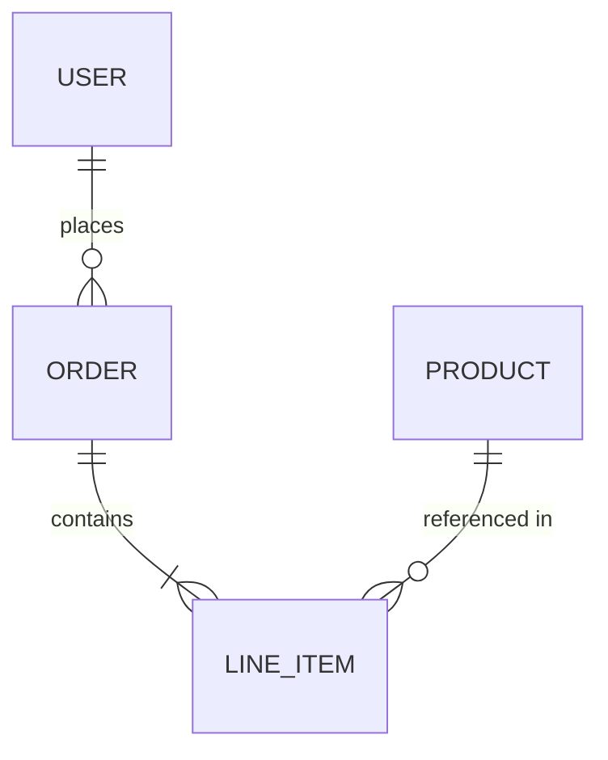

# Architecture: [Project Name]

<!--
PROJECT CUSTOMISATION:
- Replace [Project Name] with the actual project name
- Replace [Component A], [Component B] with actual system components
- Add domain-specific sections if needed (e.g., "Message Queue Design" for event-driven systems, "Caching Strategy" for high-traffic apps, "ML Pipeline" for AI/ML projects)
- For projects without an API (e.g., CLI tools, libraries), Section 4 can describe the public interface/SDK instead
- For projects without infrastructure concerns (e.g., static sites), Section 5 can be abbreviated
- The Design Decisions Log (Section 6) is critical — every non-obvious architectural choice should be recorded with its rationale
-->

## 1. System Overview
<!-- High-level diagram (mermaid) showing all components and their relationships -->

## 2. Component Design

<!-- Follow the Deep Modules principle (see skills/tdd/deep-modules.md): each component should have a small, simple public interface that hides significant internal complexity. -->
<!-- Each component should list which PRD user stories (US-NNN) and design screens (SCR-NNN) it implements. This enables traceability from requirements through design to code. -->

### 2.1 [Component A]
- **Responsibility:**
- **Implements:** US-001, US-003 (from `docs/prd.md`), SCR-001, SCR-002 (from `docs/design.md`)
- **Public Interface:** <!-- Methods/endpoints exposed to other components. Keep this small. -->
- **Internal Complexity Hidden:** <!-- What this component handles internally that callers don't need to know about -->
- **Error Handling:** <!-- How this component reports failures to callers -->
- **Key Dependencies:**

### 2.2 [Component B]
<!-- Repeat the same structure for each component -->

## 3. Data Model

### 3.1 ER Diagram

<!-- Replace with actual entities and relationships -->


### 3.2 Entity Descriptions

| Entity | Key Fields | Description |
|--------|-----------|-------------|
| [Entity A] | id, name, created_at | [What this entity represents] |
| [Entity B] | id, entity_a_id, status | [What this entity represents] |

### 3.3 Data Access Patterns

<!-- How data is queried and written. Include the most common read/write patterns, expected query volumes, and any caching strategies. -->

## 4. API Design

<!-- For projects without an API (CLI tools, libraries), describe the public interface/SDK instead -->

### Endpoints

| Method | Path | Description | Auth |
|--------|------|-------------|------|
| GET | /api/[resource] | List [resources] | Yes |
| POST | /api/[resource] | Create [resource] | Yes |

### Request/Response Example

```json
// POST /api/[resource]
// Request
{
  "name": "example",
  "type": "default"
}

// Response (201 Created)
{
  "id": "abc-123",
  "name": "example",
  "type": "default",
  "created_at": "2025-01-01T00:00:00Z"
}
```

### Error Responses

| Status | Code | Description |
|--------|------|-------------|
| 400 | VALIDATION_ERROR | Request body failed validation |
| 401 | UNAUTHORIZED | Missing or invalid authentication |
| 404 | NOT_FOUND | Resource does not exist |
| 500 | INTERNAL_ERROR | Unexpected server error |

## 5. Infrastructure & Deployment
<!-- Environments, CI/CD, hosting, monitoring -->

## 6. Design Decisions Log
<!-- Key architectural choices and WHY they were made -->
<!-- Format: Decision | Alternatives Considered | Rationale -->

## 7. Security Considerations

### 7.1 Authentication
<!-- How users authenticate (e.g., JWT, session cookies, OAuth 2.0). Include token storage, expiry, and refresh strategy. -->

### 7.2 Authorization
<!-- How permissions are enforced (e.g., RBAC, ABAC). Define roles and what each role can access. -->

### 7.3 Data Protection
<!-- Encryption at rest and in transit. PII handling. Data retention and deletion policies. -->

### 7.4 Secrets Management
<!-- How API keys, database credentials, and other secrets are stored and accessed. Never hardcode secrets. -->

## 8. Future Considerations
<!-- Known technical debt, scaling plans, migration paths -->
