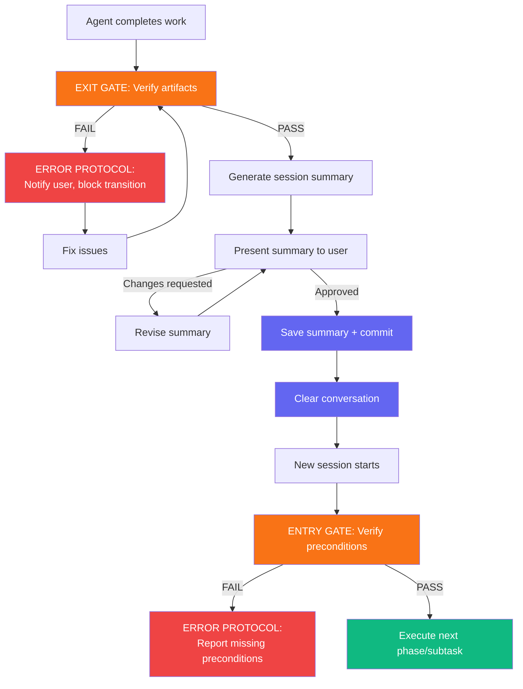

# Workflow Automation Protocol

> An event-driven orchestration layer for multi-phase projects where phase durations are unknown and dynamic. This protocol governs how agents transition between phases and subtasks — ensuring nothing starts until its preconditions are verified, and no context is lost when conversations are cleared.

The recommended execution model for Phase 3 is **agent teams with git worktrees** (see `agent-teams.md`). The options below provide simpler alternatives.

> **Navigation:** For framework overview and phase descriptions, see `CLAUDE.md`. For gate definitions, see the individual phase files in `phases/`.

---

## Prerequisites

Before using this automation protocol, ensure the following setup is complete:

### Session Summary Directory

The `session-summary/` directory must exist in the project root. Create it when initialising a new project:

```bash
mkdir -p session-summary
```

> This directory is used by all phases to store session summaries. Phase transition steps include `mkdir -p session-summary` as a safety check, but creating it upfront avoids edge cases.

### Session Summary Template

The session summary template at `templates/session-summary.md` defines the required structure. All session summaries should follow this template to ensure consistency across sessions and agents.

---

## Execution Models

Claude Code provides multiple execution models for Phase 3 — from full agent-native orchestration to simple linear loops. Agent teams are the recommended model for parallel execution; the alternatives below cover simpler scenarios.

> For the complete GitHub issue sync protocol, see `github-issue-sync.md`.

### Recommended: Agent Team Execution

For projects where you want an AI orchestrator managing parallel agents, use Claude Code's native Agent SDK team primitives (TeamCreate, SendMessage, Agent tool). This is the standard model for parallel wave execution.

**How it works:**
1. Start an interactive Claude Code session — this becomes the **orchestrator**
2. The orchestrator reads `roadmap.json`, identifies the current wave
3. Creates a team via TeamCreate, spawns implementer agents via Agent tool
4. Each implementer works in its own git worktree, following Phase 3 TDD
5. Orchestrator monitors progress via incoming SendMessage notifications
6. After all wave tasks complete, orchestrator runs the wave transition (merge → regression → gate)
7. Orchestrator shuts down the team, creates a new team for the next wave

**See `agent-teams.md` for the full protocol** — including agent role definitions, inter-agent communication, conflict resolution, and dynamic task reassignment.

**Advantages over bash-script parallelism:**
- **Dynamic task reassignment** — if one agent finishes early, the orchestrator assigns the next available task
- **Real-time inter-agent communication** — agents report blockers, discoveries, and progress via messages
- **Intelligent conflict resolution** — merge conflicts are handled by agents with full context, not script failure
- **Agent-native orchestration** — no `jq` dependency or PID management

**GitHub Issue Sync:** The orchestrator creates and manages GitHub issues as part of wave lifecycle. When spawning implementer agents, the orchestrator assigns the corresponding GitHub issue to each agent. Implementers update issue labels during TDD stages via `gh issue edit`. When the orchestrator runs wave transition, it closes completed issues, closes the wave milestone, and posts regression results to the PRD tracking issue. See `github-issue-sync.md` for the full protocol.

---

### Ralph Loop — Issue-Driven Automation (Simplest)

The simplest automation: an agent autonomously loops over GitHub issues, executing each with TDD. No wave management, no worktrees, no orchestrator — just a linear loop that picks up the next unblocked issue, reads the parent PRD for context, runs red-green-refactor, closes the issue, and moves on.

**When to use:** Small-to-medium projects, solo developer, no need for wave parallelism. The project has a PRD issue and task issues created via `github-issue-sync.md`.

**How it works:**
1. Fetch the next open, unblocked task issue
2. Read the parent PRD issue for full context
3. Execute the task using the TDD cycle (RED → GREEN → REFACTOR)
4. Close the issue with a completion comment
5. Repeat until no open task issues remain

**Script** — save as `run-ralph-loop.sh` in the project root:

```bash
#!/bin/bash
# Ralph Loop: Issue-driven autonomous TDD execution
# Loops over open GitHub issues tagged "task", executing each with TDD

set -e

MAX_ITERATIONS=50  # Safety limit
ITERATION=0

# Get the PRD issue number for context
PRD_ISSUE=$(jq -r '.prd_issue_number // empty' roadmap.json 2>/dev/null)
PRD_CONTEXT=""
if [ -n "$PRD_ISSUE" ]; then
  PRD_CONTEXT="First, read the parent PRD by running: gh issue view $PRD_ISSUE. Use it for full project context."
fi

while [ $ITERATION -lt $MAX_ITERATIONS ]; do
  ITERATION=$((ITERATION + 1))

  # Fetch the next open task issue (oldest first, skip blocked)
  NEXT_ISSUE=$(gh issue list --label "task" --state open --json number,title,labels --limit 50 \
    | jq -r '[.[] | select(.labels | map(.name) | index("blocked") | not)] | sort_by(.number) | .[0].number // empty')

  if [ -z "$NEXT_ISSUE" ]; then
    echo "No open task issues remaining. Done."
    break
  fi

  ISSUE_TITLE=$(gh issue view "$NEXT_ISSUE" --json title -q '.title')
  echo "=== Session $ITERATION: Issue #$NEXT_ISSUE — $ISSUE_TITLE ==="

  # Run Claude in headless mode against this issue
  claude -p "$PRD_CONTEXT Read CLAUDE.md and roadmap.json. Run 'gh issue view $NEXT_ISSUE' to get full task details and acceptance criteria. Execute the task following the TDD cycle in phases/phase-3-subtask-execution.md (RED: write failing tests, GREEN: implement, REFACTOR: clean up). When done, run the handoff protocol from phases/phase-4-handoff-protocol.md. Then close the issue: gh issue close $NEXT_ISSUE --comment 'Task complete. See session summary for details.'" \
    --allowedTools "Read,Edit,Write,Bash,Glob,Grep" \
    --max-turns 100 \
    --output-format json > "session-output-issue-${NEXT_ISSUE}.json" 2>&1

  EXIT_CODE=$?

  if [ $EXIT_CODE -ne 0 ]; then
    echo "Claude exited with code $EXIT_CODE on issue #$NEXT_ISSUE. Check session-output-issue-${NEXT_ISSUE}.json"
    break
  fi

  echo "Issue #$NEXT_ISSUE complete."
done

echo "Ralph loop finished after $ITERATION iterations."
```

**What this gives you:** The simplest possible automation. One agent, one issue at a time, fully autonomous. GitHub issues provide visibility into progress without needing to read `roadmap.json` directly.

**Trade-off:** No parallelism — tasks execute sequentially. For projects with independent tasks that could run simultaneously, use agent teams or bash-script parallelism instead.

---

### SessionStart Hook (For Interactive Use)

The `SessionStart` hook fires when a new session begins. Using the `matcher: "clear"` variant, it fires specifically after every `/clear` command — injecting context into the fresh session automatically.

When `/clear` runs, Claude Code creates a new session (new session ID). The `SessionStart` hook fires on that new session, and any stdout from the hook command is visible to the agent as initial context.

**How it works:**
1. Agent completes subtask → exit gate passes → summary saved → `/clear`
2. New session starts → `SessionStart` hook fires → injects latest session summary
3. Agent reads the injected context + `CLAUDE.md` → runs Entry Gate → executes next task

**Configuration** — add to `.claude/hooks.json` in the project root:

```json
{
  "hooks": {
    "SessionStart": [
      {
        "matcher": "clear",
        "hooks": [
          {
            "type": "command",
            "command": "if jq -e '[.tracks[].tasks[] | select(.status == \"Not Started\")] | length > 0' roadmap.json >/dev/null 2>&1; then echo '=== AUTO-CONTINUE ===' && echo 'Project is mid-flight. Read CLAUDE.md and roadmap.json, then run the Pickup Sequence from workflow-automation.md Section 2.2.' && echo '---' && ls -t session-summary/*.md 2>/dev/null | head -1 | xargs cat 2>/dev/null || echo 'No session summary found.'; else echo '=== PROJECT COMPLETE ===' && echo 'All tasks in roadmap.json are complete. Do NOT clear — stay in session for final review. No further subtasks to execute.'; fi"
          }
        ]
      },
      {
        "matcher": "resume",
        "hooks": [
          {
            "type": "command",
            "command": "echo '=== RESUMING ===' && ls -t session-summary/*.md 2>/dev/null | head -1 | xargs cat 2>/dev/null || echo 'No session summary found. Read CLAUDE.md and roadmap.json to orient.'"
          }
        ]
      }
    ]
  }
}
```

**What this gives you:** After every `/clear`, the hook checks `roadmap.json` for remaining `Not Started` tasks. If tasks remain, it injects the latest session summary and instructs the agent to continue. If all tasks are complete, it injects a "PROJECT COMPLETE" message instead — preventing the agent from looping unnecessarily. No typing required either way.

**GitHub Issue Sync:** The session start hook also triggers issue status sync. The agent runs `gh issue list --state all --label "task" --json number,state,labels` at session start and reconciles any external changes with `roadmap.json` before picking up the next task. See `github-issue-sync.md` Section 3.2 for the reconciliation protocol.

> **Note:** `SessionEnd` with `matcher: "clear"` also exists but has a known reliability issue (GitHub issue #6428). Do not depend on it for critical state-saving. Save summaries *before* clearing — which the Transition Protocol already requires.

---

### CLI Headless Loop (For Fully Unattended Execution)

For fully automated execution with no human involvement, use the CLI's `-p` (print/headless) mode in a shell script loop. Each iteration runs a fresh session that picks up from where the last one left off.

**Script** — save as `run-project.sh` in the project root:

```bash
#!/bin/bash
# Automated subtask execution loop
# Runs until all roadmap tasks are complete or an error occurs

MAX_ITERATIONS=50  # Safety limit
ITERATION=0

while [ $ITERATION -lt $MAX_ITERATIONS ]; do
  ITERATION=$((ITERATION + 1))
  echo "=== Session $ITERATION ==="

  # Check if there are remaining tasks
  if ! jq -e '[.tracks[].tasks[] | select(.status == "Not Started")] | length > 0' roadmap.json >/dev/null 2>&1; then
    echo "All tasks complete. Exiting."
    break
  fi

  # Run Claude in headless mode, continuing from last session
  claude -p "Read CLAUDE.md and roadmap.json. Execute the next task with status 'Not Started' following the Subtask Execution prompt in phases/phase-3-subtask-execution.md. When done, run the full Transition Protocol from workflow-automation.md Section 2.1 (VERIFY → SUMMARISE → SAVE). Do NOT clear the conversation — this script handles session boundaries." \
    --allowedTools "Read,Edit,Write,Bash,Glob,Grep" \
    --max-turns 100 \
    --output-format json > "session-output-$ITERATION.json" 2>&1

  EXIT_CODE=$?

  if [ $EXIT_CODE -ne 0 ]; then
    echo "Claude exited with code $EXIT_CODE at iteration $ITERATION. Check session-output-$ITERATION.json"
    break
  fi

  echo "Session $ITERATION complete."
done

echo "Loop finished after $ITERATION iterations."
```

**What this gives you:** Fully hands-off execution. Each loop iteration is a fresh Claude session with full context budget. The script stops when all tasks are done or an error occurs.

**GitHub Issue Sync:** Each loop iteration can fetch the next task from GitHub issues instead of parsing `roadmap.json` directly — use `gh issue list --label "task" --state open` to find the next open issue. The agent updates issue labels during TDD stages and closes the issue on completion. See `github-issue-sync.md` Section 2 for the full status sync protocol.

**Trade-off:** No human review between subtasks. Use only when you trust the eval suite to catch issues. For projects where you want to review between tasks, use the SessionStart Hook instead.

---

### Parallel Wave Execution (For Bash-Script Parallelism)

For projects with execution waves defined in `roadmap.json`, this script processes waves sequentially but runs tasks within each wave in parallel using git worktrees. Use this when you want parallelism without the overhead of agent team orchestration.

**Script** — save as `run-project-parallel.sh` in the project root:

```bash
#!/bin/bash
# Parallel wave execution loop
# Processes waves sequentially, tasks within each wave in parallel via git worktrees

set -e

ROADMAP="roadmap.json"

# Get total number of waves
TOTAL_WAVES=$(jq '.execution_plan.waves | length' "$ROADMAP")
echo "=== Project has $TOTAL_WAVES execution waves ==="

for WAVE_IDX in $(seq 0 $((TOTAL_WAVES - 1))); do
  WAVE_NUM=$(jq -r ".execution_plan.waves[$WAVE_IDX].wave" "$ROADMAP")
  TASKS=$(jq -r ".execution_plan.waves[$WAVE_IDX].tasks[]" "$ROADMAP")
  TASK_COUNT=$(echo "$TASKS" | wc -l)

  echo ""
  echo "=== Wave $WAVE_NUM ($TASK_COUNT tasks) ==="

  # Check if all tasks in this wave are already complete
  ALL_DONE=true
  for TASK in $TASKS; do
    STATUS=$(jq -r ".tracks[].tasks[] | select(.id == \"$TASK\") | .status" "$ROADMAP")
    if [ "$STATUS" != "Completed" ]; then
      ALL_DONE=false
      break
    fi
  done

  if [ "$ALL_DONE" = true ]; then
    echo "Wave $WAVE_NUM already complete, skipping."
    continue
  fi

  # Launch each task in its own worktree
  PIDS=()
  BRANCHES=()
  for TASK in $TASKS; do
    STATUS=$(jq -r ".tracks[].tasks[] | select(.id == \"$TASK\") | .status" "$ROADMAP")
    if [ "$STATUS" = "Completed" ]; then
      echo "  Task $TASK already complete, skipping."
      continue
    fi

    BRANCH="feature/task-$TASK"
    WORKTREE="worktree/$BRANCH"

    echo "  Launching task $TASK in worktree $WORKTREE..."
    git worktree add "$WORKTREE" -b "$BRANCH" 2>/dev/null || git worktree add "$WORKTREE" "$BRANCH"

    (cd "$WORKTREE" && claude -p "Read CLAUDE.md and roadmap.json. Execute Task $TASK following the TDD cycle in phases/phase-3-subtask-execution.md (RED: write failing tests, GREEN: implement, REFACTOR: clean up). When done, run the handoff protocol from phases/phase-4-handoff-protocol.md. Do NOT merge to main — the wave transition protocol handles that." \
      --allowedTools "Read,Edit,Write,Bash,Glob,Grep" \
      --max-turns 100 \
      --output-format json > "../../session-output-wave${WAVE_NUM}-task${TASK}.json" 2>&1) &

    PIDS+=($!)
    BRANCHES+=("$BRANCH")
  done

  # Wait for all tasks in this wave to complete
  FAILED=false
  for i in "${!PIDS[@]}"; do
    if ! wait "${PIDS[$i]}"; then
      echo "  ERROR: Task in branch ${BRANCHES[$i]} failed (PID ${PIDS[$i]})"
      FAILED=true
    fi
  done

  if [ "$FAILED" = true ]; then
    echo "Wave $WAVE_NUM had failures. Stopping. Check session-output files for details."
    exit 1
  fi

  # Wave Transition Protocol: see wave-execution.md Section 2 for the full canonical sequence.
  # This script implements the solo/bash-script subset (MERGE, REGRESSION, GATE, SYNC ISSUES, RECOMPUTE, LAUNCH).
  echo ""
  echo "=== Wave $WAVE_NUM complete — running wave transition ==="

  for BRANCH in "${BRANCHES[@]}"; do
    WORKTREE="worktree/$BRANCH"
    echo "  Merging $BRANCH into main..."
    git merge "$BRANCH" --no-ff -m "merge $BRANCH (wave $WAVE_NUM)"
    git worktree remove "$WORKTREE" 2>/dev/null || true
    git branch -d "$BRANCH" 2>/dev/null || true
  done

  > **Note — No merge conflict handling:** The bash-script parallel mode runs `git merge` and stops if a conflict occurs. This is intentional — the bash mode is designed for non-overlapping tasks where conflicts should never arise. If a conflict occurs, it indicates a wave planning error (tasks share file writes). Resolve manually, or use agent teams mode which has a full conflict resolution protocol (`agent-teams.md` Section 4.4).

  echo "  Running full regression suite..."
  npx playwright test || {
    echo "  REGRESSION DETECTED after wave $WAVE_NUM merge. Fix before continuing."
    exit 1
  }

  echo "=== Wave $WAVE_NUM merged and regression passed ==="
done

echo ""
echo "=== All waves complete ==="
```

**What this gives you:** Parallel task execution within waves, sequential wave processing, automatic merge and regression after each wave. Each task runs in an isolated git worktree so agents cannot conflict.

**GitHub Issue Sync:** Wave milestones are created as GitHub milestones during Phase 2 (see `github-issue-sync.md` Section 4.1). Each worktree agent is assigned a specific GitHub issue and updates its labels during TDD stages. When a wave completes and regression passes, the wave milestone is closed and regression results are posted to the PRD tracking issue. See `github-issue-sync.md` Section 4.2 for wave completion sync.

**`roadmap.json` write responsibility:** Individual worktree agents do NOT update `roadmap.json`. After all agents in a wave complete, the main-branch script updates `roadmap.json` centrally before running the wave transition protocol. This prevents concurrent write conflicts across worktrees operating on separate copies of the file.

**Trade-off:** Requires `jq` for JSON parsing. More complex error handling — if one task in a wave fails, the entire wave stops. Merge conflicts are possible if wave computation missed a file overlap.

> **CLI Tool Access:** When `Bash` is in the `--allowedTools` list, the agent can invoke any installed CLI tool. See Section 6 for the full reference.

---

### Which Execution Model to Use

| Scenario | Model | GitHub Issue Integration | Why |
|----------|-------|--------------------------|-----|
| 2+ parallel tasks, real-time coordination | **Agent teams (recommended)** | Orchestrator manages issue lifecycle per wave | AI orchestrator with dynamic reassignment and inter-agent messaging |
| Parallel tasks, no coordination needed | **Parallel wave execution** | Wave milestones, per-worktree issue assignment | Multiple agents per wave via bash scripts, regression gates between waves |
| Large project, fully unattended, sequential | **CLI headless loop** | Each iteration fetches next open issue | Fresh context per subtask, no human in the loop |
| Interactive work, reviewing between subtasks | **SessionStart hook** | Syncs issue status at session start | Clears context, injects summary, waits for you |
| Small project, solo developer, linear execution | **Ralph Loop** | Fetches next open issue, closes on completion | Simplest automation — one agent loops over issues with TDD |
| Mixed: unattended for routine, interactive for complex | **Combine models as needed** | All models sync with GitHub issues | Use agent teams for complex phases, simpler models for straightforward phases |

### Pickup Sequence (All Execution Models)

Regardless of which execution model is used, the agent follows the same Pickup Sequence at the start of each new task. See Section 2.2 for the Pickup Sequence.

---

## Core Principle: Event-Driven, Not Time-Driven

Phase transitions are triggered by **verified completion events**, not timers or schedules. A phase ends when its exit gate passes. The next phase begins when a fresh session reads the saved context. Phase durations are irrelevant — a phase takes as long as it takes.



---

## 1. Gate System

Every phase transition passes through two gates: an **Exit Gate** (can I leave?) and an **Entry Gate** (can I start?). Gates are verification checkpoints — they inspect artifacts on disk, not conversation state. This makes them survive context clears.

> **Note:** The authoritative gate definitions live in the individual phase files. The tables below are a reference map only — always defer to the linked phase file for the full gate checklist.

### 1.1 Exit Gates (Run Before Leaving a Phase)

The agent MUST run the exit gate before generating a session summary. If any check fails, the agent cannot proceed.

| Phase | Authoritative Source | Summary |
|-------|---------------------|---------|
| Phase 1 | `phases/phase-1-intent-discovery.md` → Exit Gate | All Discovery Checklist topics covered, Echo Check confirmed, Blueprint approved |
| Phase 2 | `phases/phase-2-specification-eval-generation.md` → Exit Gate | All 5 docs generated, eval linkage verified, user approved. **If GitHub available:** issues created for all roadmap tasks, wave milestones created, label schema applied, PRD tracking issue created (see `github-issue-sync.md` Section 1) |
| Phase 3 | `phases/phase-3-subtask-execution.md` → Exit Gate | TDD commits exist, task evals pass, no regressions, GitHub issue updated |
| Phase 4 | `phases/phase-4-handoff-protocol.md` → Step 3: Validate | Per-subtask documentation handoff: acceptance criteria met, docs updated, committed, session summary saved. GitHub issue commented (closed at wave transition, not per-subtask). |

### 1.2 Entry Gates (Run Before Starting a Phase)

The agent MUST run the entry gate at the start of every new session. If any check fails, the agent reports what's missing and stops — it does not attempt to work around the gap.

| Phase | Authoritative Source | Summary |
|-------|---------------------|---------|
| Phase 1 | `phases/phase-1-intent-discovery.md` → Entry Gate | Project concept provided, framework files accessible |
| Phase 2 | `phases/phase-2-specification-eval-generation.md` → Entry Gate | Phase 1 session summary exists, templates accessible |
| Phase 3 | `phases/phase-3-subtask-execution.md` → Entry Gate | Project docs exist, next task identified, dependencies met. **If GitHub available:** GitHub issue exists and is open for the current task (see `github-issue-sync.md` Section 6.2) |

---

## 2. Transition Protocol

This is the step-by-step sequence the agent follows when completing any phase or subtask. It replaces ad-hoc "wrap up" behavior with a deterministic flow.

### 2.1 Completion Sequence

When the agent believes its current work is done:

```
Step 1: VERIFY
  └─ Run the Exit Gate for the current phase
  └─ If ANY check fails → go to Error Protocol (Section 4)
  └─ If ALL checks pass → continue

Step 2: SUMMARISE
  └─ Generate a session summary covering:
     ├─ What was accomplished (decisions made, artifacts produced, code written)
     ├─ Exit Gate results (all checks listed with PASS)
     ├─ What the next session should do (specific task reference)
     └─ Any open questions or risks discovered

Step 3: PRESENT
  └─ Show the summary to the user
  └─ Ask: "Does this summary accurately capture the session? Ready to save and clear?"
  └─ If user requests changes → revise and re-present
  └─ If user approves → continue

Step 4: SAVE
  └─ Create session-summary/ directory if it doesn't exist: mkdir -p session-summary
  └─ Save the session summary to session-summary/ with timestamp filename:
       Phases: YYYY-MM-DD-phase-N.md | Subtasks: YYYY-MM-DD-task-X.Y.md
  └─ Commit all changes (code, docs, summary)

Step 5: CLEAR
  └─ Clear the conversation to free the context window
  └─ The session is now over
```

### 2.2 Pickup Sequence

When a new session starts:

```
Step 1: ORIENT
  └─ Read the most recent session summary from session-summary/
  └─ Read claude.md for project overview and current status
  └─ Read roadmap.json to identify the next task

Step 1b: RECOVERY CHECK
  └─ If roadmap.json shows tasks with status "In Progress":
     A prior session may have crashed mid-execution.
     Follow the recovery procedure for your execution mode — see
     `workflow-automation.md` Section 4.2 for solo and bash-script recovery,
     and `agent-teams.md` Section 7 for team recovery.
     Do NOT start new work until recovery is complete.

Step 2: GATE
  └─ Run the Entry Gate for the current phase
  └─ If ANY check fails → go to Error Protocol (Section 4)
  └─ If ALL checks pass → continue

Step 3: CONTEXT
  └─ Read docs/evals.json to understand what's tested and what's not
  └─ Read any files listed in the task's "Context Needed"
  └─ Review the task's acceptance criteria and assigned eval IDs

Step 4: EXECUTE
  └─ Begin work on the identified task
  └─ Follow the prompt from phases/phase-3-subtask-execution.md
```

---

## 3. Context Window Management

### 3.1 When to Clear

The conversation is cleared **only** when all of these are true:

1. The Exit Gate has passed (all verification checks green)
2. The session summary has been saved to disk
3. The user has approved the summary
4. All changes are committed

The agent MUST NOT clear the conversation if:
- Any exit gate check has failed
- The user has requested changes to the summary
- There are uncommitted changes
- The user has indicated they want to continue in the same session

### 3.2 What the Summary Must Capture

The session summary is the **sole bridge** between the cleared conversation and the next session. If information isn't in the summary or in a project document on disk, it is lost.

Required summary sections:

| Section | Content |
|---------|---------|
| **Session ID** | Timestamp and phase/task reference (e.g., "2026-03-14 — Phase 3, Task 2.3") |
| **Objective** | What this session set out to do |
| **Outcome** | What was accomplished — decisions, artifacts, code |
| **Eval Results** | Each eval ID tested with PASS/FAIL status |
| **Gate Results** | Exit Gate checks with PASS/FAIL for each |
| **Files Modified** | List of every file created or changed |
| **Open Items** | Questions, risks, or blockers discovered but not resolved |
| **Errors Encountered** | Any errors hit during the session (omit if none) |
| **Next Action** | Exact task reference for the next session (e.g., "Execute Task 2.4 from roadmap.json") |

> Use the template at `templates/session-summary.md` for the full structure.

### 3.3 Context Preservation Hierarchy

When a session clears, the next session reconstructs context from these sources, in priority order:

```
1. session-summary/     ← What just happened (most recent session)
2. roadmap.json           ← What to do next (source of truth for progress)
3. claude.md            ← Project overview and current status
4. docs/evals.json        ← What's passing, what's not tested
5. docs/architecture.md ← How the system is designed
6. docs/prd.md          ← What the product should do
```

The agent reads sources 1-4 at session start. Sources 5-6 are read only if the current task requires architectural or requirements context.

---

## 4. Error Protocol

> The shared error protocol is defined in `error-protocol.md`. This section covers only execution-model-specific error extensions.

For all core error types (missing document, failed evals, dependency not met, etc.), escalation rules, and error logging format, see `error-protocol.md`.

### 4.1 Execution-Model-Specific Errors

| Error | Detection | Agent Response |
|-------|-----------|----------------|
| **Regression unfixable** | Fix failed after 2 attempts at wave transition | Trigger Rollback Protocol (`agent-teams.md` Section 4.5). Revert merge, preserve branches, reset statuses, reopen issues. **Block transition.** |

### 4.2 Mode-Specific Recovery Procedures

When a session crashes mid-execution and `roadmap.json` shows tasks with status `"In Progress"`, follow the procedure for your execution mode.

#### Solo Mode Recovery

1. ASSESS — Read roadmap.json. Identify any task with status "In Progress".
2. CHECK GIT — Run `git status` and `git log --oneline -5`:
   - If uncommitted changes exist: review them. If they look correct, stage and commit.
     If unclear, stash with `git stash` and note in session summary.
   - If RED/GREEN commits exist on the branch: the TDD cycle was partially complete.
     Determine which stage was reached (RED only? GREEN done? REFACTOR pending?).
3. CHECK TESTS — Run the project test suite against the current branch:
   - All tests pass: task may be complete. Verify acceptance criteria.
   - Some tests fail: implementation was incomplete. Resume from GREEN stage.
   - No test files exist for task evals: resume from RED stage.
4. RESUME — Update roadmap.json if needed (set status back to "In Progress"
   with a completion_notes entry noting the crash recovery). Resume the
   TDD cycle from the stage identified in step 2.
5. LOG — Include the crash recovery in the session summary under
   "Errors Encountered" with error type "Session crash recovery".

#### Bash-Script Parallel Mode Recovery

1. ASSESS — Read roadmap.json. Identify all tasks with status "In Progress".
   Run `git worktree list` to identify which worktrees still exist.
2. FOR EACH IN-PROGRESS TASK:
   a. If worktree exists and branch has commits:
      - cd into the worktree
      - Run tests: if all pass, task may be complete
      - If tests fail or are incomplete, note the state
   b. If worktree exists but no commits beyond the branch point:
      - Task never started or crashed immediately
      - Reset to "Not Started" in roadmap.json
   c. If no worktree found:
      - Reset to "Not Started" in roadmap.json
3. DECIDE — For each assessed task:
   | State | Action |
   |-------|--------|
   | Tests pass, acceptance criteria met | Mark "Completed", proceed to wave transition |
   | Tests pass, acceptance criteria partial | Resume in existing worktree |
   | Tests fail | Resume from GREEN stage in existing worktree |
   | No test files | Reset to "Not Started", re-run in next wave attempt |
4. WAVE TRANSITION — If all wave tasks are now complete or reset,
   run the wave transition protocol from wave-execution.md Section 2.
   If some tasks are complete and others reset, merge the complete ones
   and recompute waves for the remaining tasks.
5. LOG — Write a recovery summary to session-summary/ documenting
   what was found and what action was taken for each task.

#### Agent-Team Mode Recovery

See `agent-teams.md` Section 7.1 (Orchestrator Recovery Protocol). Unchanged.

---

## 5. Phase Transition Rationale

Each phase transition clears the conversation for a specific reason. The step-by-step transition sequences are defined in the individual phase files (see each phase's "When You're Done — Transition Protocol" section). This section captures only **why** each clear is valuable.

| Transition | Why Clear Here |
|------------|---------------|
| **Phase 1 → Phase 2** | Phase 1 is conversational and can consume significant context with multi-round Q&A. The confirmed intent is now captured in the summary — the raw conversation is no longer needed. |
| **Phase 2 → Phase 3** | Phase 2 produces large documents that are now saved to disk. The context window was used for generation — the next session only needs to read the finished artifacts. |
| **Subtask N → Subtask N+1** | Each subtask runs a full Phase 3 (TDD) + Phase 4 (per-subtask documentation handoff) cycle, consuming context with code reads, edits, debugging, and eval runs. Clearing ensures the next subtask starts with maximum available context for its own work. |
| **Final Task → Project Done** | Do NOT clear after the final task. Save the summary but stay in session — the user may want to review the completed project in context. |

---

## 6. CLI Tool Access

### 6.1 Principle

Agents with **Bash** access can invoke any installed CLI tool. The `--allowedTools` list in execution scripts controls which Claude Code tools the agent can use (Read, Edit, Write, Bash, etc.) — not which shell commands are available. When Bash is in the allowed tools list, the agent has full CLI access.

### 6.2 Available CLI Tools

| Tool | Command | Purpose | Typical Phase |
|------|---------|---------|---------------|
| **Playwright** | `npx playwright test` | E2E testing, eval validation | Phase 3 (TDD), regression |
| **GitHub CLI** | `gh` | PRs, issues, checks, releases | Phase 3/4, wave transitions |
| **Supabase CLI** | `supabase` | DB migrations, local dev, type generation | Phase 3 (if applicable) |
| **Vercel CLI** | `vercel` | Deployments, environment variables, preview URLs | Phase 3/4 (if applicable) |
| **jq** | `jq` | JSON processing (roadmap, evals parsing) | Scripts, orchestrator |
| **Git** | `git` | Version control, worktrees, branching | All phases |
| **Node/npm** | `node`, `npm`, `npx` | Build, test, run, package management | Phase 3 |

### 6.3 Project-Specific CLI Configuration

Projects should document which CLI tools are required in their `claude.md` under "Tech Stack" or "Key Conventions." This ensures agents know which tools are available without guessing.

Example entry for a project's `claude.md`:

```markdown
## CLI Tools Available
- `npx playwright test` — E2E tests
- `gh` — GitHub operations
- `supabase` — database migrations and local dev
- `vercel` — deployments and preview URLs
```

---

## 7. Project Completion Protocol

### 7.1 Completion Gate Checklist

| Check | How to Verify | Required |
|-------|---------------|----------|
| All roadmap tasks completed | Every task in `roadmap.json` has status "Completed" | Yes |
| All evals passing | `docs/evals.json` has 0 failing, 0 not_yet_tested | Yes |
| Final regression green | Full test suite passes on main | Yes |
| All GitHub issues closed | `gh issue list --state open --label task` returns empty | If GitHub available |
| All wave milestones closed | `gh api repos/{owner}/{repo}/milestones --jq '.[] | select(.state=="open")'` returns empty | If GitHub available |
| Documentation current | `claude.md`, `docs/prd.md`, `docs/design.md`, `docs/architecture.md` reflect final state | Yes |
| No TODO markers | No `<!-- TODO -->` markers remain in project docs (note: `<!-- TEMPLATE: -->` markers in templates are excluded — those are intentional placeholders for reuse) | Yes |
| `roadmap.json` complete | `overall_progress.completed` equals `overall_progress.total` | Yes |
| Final session summary exists | A summary file for the last task exists in `session-summary/` | Yes |
| User sign-off | User has explicitly confirmed project is done | Yes |

### 7.2 Completion Procedure

```
1. RUN GATE — Execute the Completion Gate Checklist above.
   If any check fails, report what's missing and fix before continuing.

2. SUMMARISE — Generate a project completion summary:
   - Total tasks completed and total waves executed
   - Total sessions used
   - Final eval results (all IDs with PASS)
   - Deferred items (if any)
   - Lessons learned and notable decisions

3. CLOSE TRACKING — Close the PRD tracking issue with the completion summary:
   gh issue close <prd_issue_number> --comment "Project complete. [summary]"

4. PRESENT — Present the completion summary to the user for sign-off.

5. STAY IN SESSION — Do NOT clear. Remain available for review.
```

### 7.3 Partial Completion

If the user wants to stop before all tasks are done:

1. Generate a partial completion summary covering work completed so far
2. Ensure `roadmap.json` accurately reflects current state (completed, in-progress, not started, deferred)
3. Leave remaining tasks as "Not Started" or "Deferred" with clear rationale
4. Do NOT close the PRD tracking issue
5. Save the partial summary to `session-summary/`
